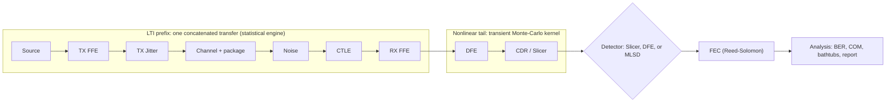

# EyeQ

**An open, interactive behavioral link-modeling tool for high-speed wireline SerDes.**

EyeQ runs a continuously-updating model of an end-to-end serial link and shows the receiver eye
diagram (NRZ / PAM-4) responding *in real time* to the transmitter FFE, channel loss, CTLE, RX FFE,
DFE, CDR sampling phase, jitter, and noise, alongside the frequency cascade, pulse response, bathtub
curves, a live performance report, FEC post-decode BER, and MLSD sequence-detection estimates. It is a
pure-Python tool, built for design-space exploration and equalization/FEC/detection co-design at
**112 / 224 / 448 Gb/s** across **NRZ and PAM-4**.


---

## Why EyeQ?

A modern wireline link runs at tens of gigabaud over a channel that loses 15 to 30 dB at Nyquist, and
recovering data through it takes a stack of equalizers (TX FFE, CTLE, RX FFE, DFE), clock recovery, and
forward error correction. The central question is how to predict a link's bit error rate *before* it is
built. Transistor-level (SPICE) simulation cannot: compliance targets are BER ≤ 10⁻¹², which is
trillions of bits, and circuit simulation of even a million bits is already days of compute.

**Behavioral link modeling** is the standard answer. Each block is modeled by its behavior (a transfer
function for the linear stages, a probability distribution for noise and jitter, a decision rule for the
nonlinear ones); the link splits into an LTI cascade and a nonlinear tail (the IBIS-AMI `Init`/`GetWave`
split the industry already uses); and the eye and BER are computed analytically by a *statistical*
engine (reaching BER ~10⁻¹⁸ by integrating the distribution tails) and validated by a fast Monte-Carlo
*transient* engine. This is orders of magnitude faster than circuit simulation, and fast enough to be
interactive: drag a CTLE pole and watch the eye and BER respond.

EyeQ makes that loop open and live. It is pure-Python and rate-agnostic (one codebase for 112/224/448G,
NRZ and PAM-4), built on the modeling and optimization framework of Shakiba, Tonietto & Sheikholeslami
(*High-Speed Wireline Links, Parts I and II*, IEEE OJSSCS 2024), and aimed at researchers, students, and
architects who want to *explore* link trade-offs rather than produce a single compliance number.
Behavioral models are approximations, so EyeQ labels every model-bounded or unmodeled quantity directly
in the UI and report (post-FEC BER assumes i.i.d. symbol errors; MLSD uses a minimum-distance union
bound; crosstalk and DJ/SJ jitter are deferred) and never presents a textbook gain as if it captured
real silicon.

---

## Features

- **Live RX eye** (NRZ and PAM-4) annotated with eye height, eye width, and the CDR-recovered sampling
  point.
- **Two engines on one pipeline:** a sub-millisecond statistical engine (cascade, SBR, PDA eye giving
  BER/COM/bathtubs to ~10⁻¹⁸) and a continuous Monte-Carlo transient engine (≥1.5 M UI/s, Numba kernel).
- **Every block tunable:** TX FFE + driver, two analytical channel models plus Touchstone `.s4p` import,
  CTLE, RX FFE, DFE, CDR (bang-bang and Mueller-Müller phase detectors), jitter, and noise, with controls
  auto-generated from each block's parameter schema.
- **One-click MMSE Auto-EQ** that co-optimizes the TX/RX/DFE equalization split.
- **Per-stage EQ bypass toggles** to isolate any equalizer's contribution.
- **Performance assessment:** BER, COM, horizontal/vertical bathtub curves, eye margins, MSE-SNR.
- **Forward Error Correction (FEC):** Reed-Solomon KP4 / KR4 / custom, with pre- vs post-FEC BER side by
  side and the pre-FEC threshold marked on the bathtub.
- **MLSD / Viterbi sequence detection** as a selectable receiver mode, with a minimum-distance BER
  estimate.
- **Extensible report panel** with capture and compare across configurations.
- **Zoom / pan / one-action reset** and **PNG / CSV export** on every plot.
- **Reproducible configs** (YAML/JSON) and a fully headless, scriptable, unit-tested engine.

---

## Screenshots

| 112G NRZ link | Bathtub curves (with FEC overlay) |
|:---:|:---:|
|  |  |

| Link performance report | FEC settings |
|:---:|:---:|
|  |  |

The NRZ image shows ~26 dB Nyquist loss vs the PAM-4 image's 16 dB on the *same* physical trace, because
NRZ@112G has a 56 GHz Nyquist while PAM-4@112G has 28 GHz. That is "rate is metadata" in action.

---

## Quick start

EyeQ targets **Python 3.11**. The virtual environment lives **outside** the project directory at
`~/eyeq-venv` (see the note below).

```bash
# 1. create the environment and install (engine + sim + GUI extras)
python3.11 -m venv ~/eyeq-venv
~/eyeq-venv/bin/pip install -e ".[dev,sim,gui]"

# 2. launch the dashboard (112G PAM-4 VSR by default)
./run_dashboard.sh
# or a specific scenario:
./run_dashboard.sh --config examples/112g_pam4.yaml
```

Then in the dashboard: click **Start** to run the transient engine, then **Auto-EQ** to watch a closed
eye snap open. Close the window (or press Ctrl+C in the terminal) to quit.

> **Why is the venv outside the project?** On macOS with iCloud-synced folders (Desktop/Documents),
> iCloud creates conflict-copies of binary packages while `pip` writes them, which breaks Qt's
> platform-plugin loading. Keeping the venv (and ideally the whole project) out of iCloud-synced folders
> avoids this. `run_dashboard.sh` also self-heals the macOS hidden-file flag on the Qt plugins and pins
> the plugin path. See [docs/Getting-Started.md](docs/Getting-Started.md#installation) for details.

---

## Using the dashboard

A quick orientation (full walkthrough in **[Getting Started](docs/Getting-Started.md)**):

- **Eye:** the live RX density eye, annotated with eye height/width and the CDR sampling phase.
- **Histogram / Frequency cascade / Pulse response:** the amplitude distribution at the decision point,
  the per-stage transfer cascade, and the single-bit (pulse) response with cursors.
- **Controls:** an auto-generated panel, one group per block; drag a slider and the relevant plots
  update live.
- **Toolbar:** Start/Stop, Auto-EQ, per-stage **EQ bypass** checkboxes, the **Detector** selector
  (Slicer / DFE / MLSD), a **FEC** toggle, the **Bathtub** / **Report** / **FEC** / **Detector** setting
  windows, modulation and rate selectors, and config Load/Save.
- **Right-click any plot** for zoom-reset and PNG/CSV export; **double-click** to fit-to-default.

### Headless / scripting

The engine is fully usable without the GUI:

```python
from eyeq.io import build_pipeline, default_link_config
from eyeq.engines import StatisticalEngine
from eyeq.analysis import ber, fec
from eyeq.analysis.optimize import optimize_link

pipe = build_pipeline(default_link_config(modulation="PAM4", reach_class="LR"))
pipe.apply_params({"noise": {"sigma_mvrms": 8.0}})
optimize_link(pipe)                                  # one-click MMSE auto-EQ

stat = StatisticalEngine()
_, sbr, _ = stat.compute(pipe)
r = ber.assess(stat, pipe, sbr, target_ber=pipe.ctx.reach.target_ber)
print(f"BER={r.ber:.2e}  COM={r.com_db:+.1f} dB  eye height={r.eye_height_v*1e3:.1f} mV")

f = fec.assess_fec(r, pipe.ctx, {"enabled": True, "scheme": "kp4", "target_post_ber": 1e-15})
print(f"post-FEC BER={f.post_ber:.2e}  coding gain={f.coding_gain_db:+.1f} dB")
```

See `examples/run_link.py` for a runnable headless example.

---

## Documentation

- **[Getting Started & Usage Guide](docs/Getting-Started.md):** installation (with troubleshooting), a
  full dashboard tour, and step-by-step workflows (Auto-EQ, EQ isolation, reading the bathtub, the
  report, FEC, MLSD, capture/compare, export) plus headless recipes.
- **[Technical Reference](docs/EyeQ-Technical-Reference.md):** the complete theory and equations for
  every block, both engines, the analysis methods (BER/COM/bathtubs, FEC, MLSD), the GUI, configuration,
  fidelity limits, and references.

---

## Architecture



- **Statistical engine:** frequency cascade, then single-bit response, then a peak-distortion-analysis
  eye, then BER / COM / bathtubs (analytic, deterministic, sub-millisecond).
- **Transient engine:** a Monte-Carlo symbol stream folded into a decaying 2-D density eye, with the
  DFE/CDR/slicer in an `@njit(nogil)` kernel on a worker thread (the GUI pulls a double-buffered
  snapshot).
- **Rate is metadata:** everything scales with the loss budget, not the rate, in one immutable
  `SimContext`, so NRZ and PAM-4 at the same reach get identical buffer sizes.

The engine is headless, scriptable, and unit-tested; the GUI (`eyeq/gui/`) is a thin, swappable client.
Core contracts live in `eyeq/core/` (`SimContext`, `Param`/`Kind`, `Block`, `Pipeline`).

---

## Status & roadmap

**Implemented:** statistical and transient engines; both analytical channel models plus
synthetic/measured Touchstone import; the full equalizer set; closed-form MMSE Auto-EQ; real CDR
(bang-bang and Mueller-Müller); BER/COM/bathtubs; per-stage EQ bypass; FEC (KP4/KR4/custom); MLSD
detection; the extensible report; and the live dashboard with export. 200+ tests pass.

**Deferred (labeled as such in the UI):** crosstalk (FEXT/NEXT), package-`.s4p` import, DJ/SJ jitter and
decomposition, and the compliance metrics SNDR / RLM / ERL / jitter-tolerance (present as "not modeled"
report rows). MLSD currently estimates BER via a minimum-distance union bound (no live Viterbi); the
analytic decision-point BER reflects the linear-equalized eye (DFE cancellation appears in the transient
SER).

---

## Validation

`tests/` (200+ tests) covers every block and engine plus golden/validation tests, including the
**keystone** check (the transient density eye converges to the statistical eye for an LTI-only link),
the canonical **KP4 FEC waterfall** (pre-FEC threshold ≈ 2.4×10⁻⁴, ~6.9 dB coding gain), and the **MLSD
matched-filter-bound** anchor.

```bash
~/eyeq-venv/bin/pytest          # run the suite
```

Regenerate the synthetic reference channels with
`python examples/generate_reference_channels.py`.

---

## Repository layout

```
eyeq/
  core/        SimContext, parameter schema, Block protocol, Pipeline, registry
  blocks/      source, txffe, txjitter, channel, noise, ctle, rxffe, dfe, cdr_slicer
  engines/     statistical, transient, worker (threaded snapshot), _kernels (Numba)
  analysis/    ber, fec, mlsd, optimize (MMSE auto-EQ), report
  io/          config, touchstone, synth_channel
  channel_model.py, spectral.py
  gui/         dashboard, binding, plots, panels
examples/      run_link.py, generate_reference_channels.py, *.yaml, data/*.s4p
docs/          Getting-Started.md, EyeQ-Technical-Reference.md, img/
tests/         per-block, per-engine, and golden/validation tests
```

---

## References

Built on the modeling and optimization framework of:

> M. Shakiba, D. Tonietto & A. Sheikholeslami, *"High-Speed Wireline Links, Part I: Modeling"* and
> *"Part II: Optimization and Performance Assessment,"* IEEE Open Journal of the Solid-State Circuits
> Society (OJSSCS), 2024.

FEC parameters follow IEEE Std 802.3 (RS-FEC KP4/KR4); CDR phase detectors follow Alexander (bang-bang)
and Mueller-Müller; minimum-phase reconstruction follows Oppenheim & Schafer. Full citations are in the
[Technical Reference](docs/EyeQ-Technical-Reference.md#20-references).

---

## License

Released under the [MIT License](LICENSE).
