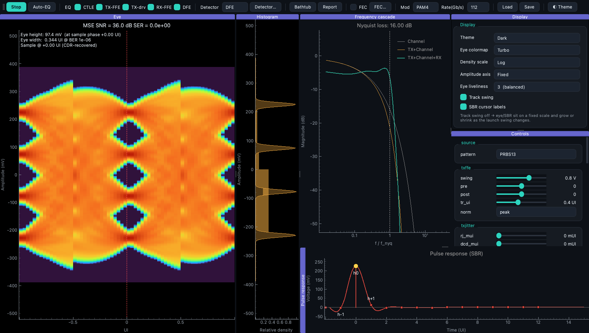
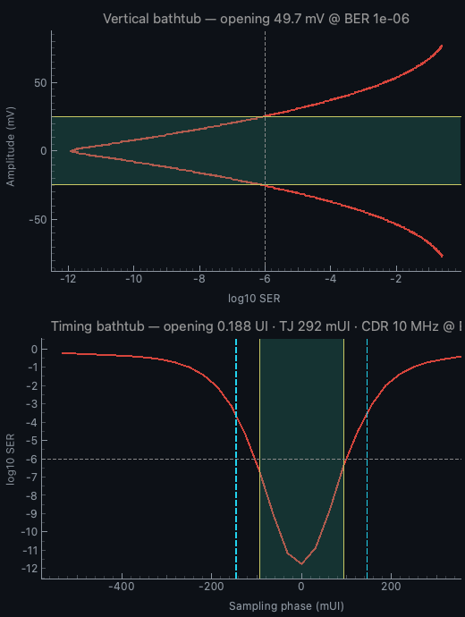
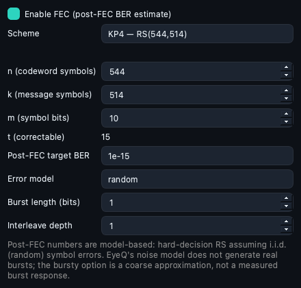
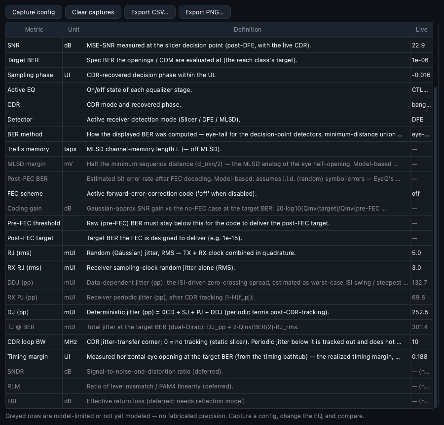
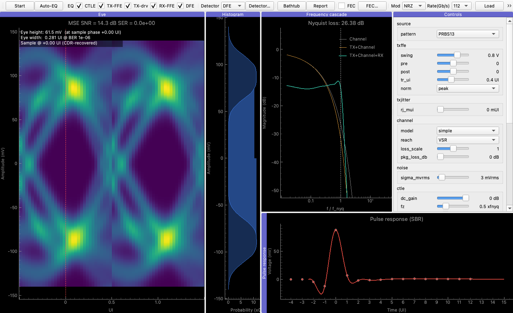

# EyeQ — Master Technical Reference

**Theory, Operation, and Usage of the EyeQ SerDes link-modeling tool.**

> **Related documentation:** [README](../README.md) (overview & motivation) ·
> [Getting Started & Usage Guide](Getting-Started.md) (install + dashboard walkthrough). This document
> is the authoritative reference for the modeling theory, the governing equations of every block and
> engine, the analysis methods (BER, COM, bathtubs, FEC, MLSD), the GUI, configuration, fidelity limits,
> and usage. 



---

## Table of contents

1. [Introduction & design philosophy](#1-introduction--design-philosophy)
2. [System architecture](#2-system-architecture)
3. [The rate spine — `SimContext`](#3-the-rate-spine--simcontext)
4. [Core contracts — schema, blocks, pipeline, registry](#4-core-contracts)
5. [Signal-path blocks](#5-signal-path-blocks)
6. [Spectral utilities](#6-spectral-utilities)
7. [Statistical engine](#7-statistical-engine)
8. [Transient engine & worker](#8-transient-engine--worker)
9. [Equalization & closed-form auto-EQ](#9-equalization--closed-form-auto-eq)
10. [Performance assessment — BER, bathtubs, COM](#10-performance-assessment)
11. [Forward Error Correction (FEC)](#11-forward-error-correction-fec)
12. [MLSD / sequence detection](#12-mlsd--sequence-detection)
13. [The report registry & metrics](#13-the-report-registry--metrics)
14. [GUI / dashboard](#14-gui--dashboard)
15. [Configuration & reproducibility](#15-configuration--reproducibility)
16. [Fidelity, assumptions & limitations](#16-fidelity-assumptions--limitations)
17. [Installation & usage](#17-installation--usage)
18. [Validation & testing](#18-validation--testing)
19. [Notation & glossary](#19-notation--glossary)
20. [References](#20-references)

---

## 1. Introduction & design philosophy

**EyeQ** is a pure-Python, interactive SerDes (serializer/deserializer) link-modeling tool — a Python
analogue of the MATLAB SerDes Toolbox. It runs a continuously-updating model of an end-to-end serial
link and shows the receiver eye diagram (NRZ / PAM-4) responding in real time to the transmitter FFE,
channel loss, CTLE, RX FFE, DFE, CDR sampling phase, jitter, and noise — alongside the frequency
cascade, single-bit response (SBR), bathtub curves, a link-performance report, FEC post-decode BER, and
MLSD sequence-detection estimates.

It supports **112 / 224 / 448 Gb/s** from one codebase and **NRZ and PAM-4** as first-class modulations.

### 1.1 Core architectural ideas

1. **LTI cascade + nonlinear tail** (the IBIS-AMI `Init`/`GetWave` split). The link splits into a
   linear, time-invariant prefix (Source → TX FFE → Channel → CTLE → RX FFE) whose effect is a single
   concatenated transfer function, and a nonlinear / time-varying tail (DFE → CDR/Slicer) whose
   decision-directed feedback must be run sample-by-sample.

2. **Two engines on one pipeline.**
   - The **statistical engine** (`Init`-like) is fast, deterministic, and analytic: it produces the
     frequency cascade, the SBR, and a peak-distortion-analysis (PDA) statistical eye, and from those
     the BER, COM, and bathtub curves — reaching error rates far below what Monte-Carlo can resolve.
   - The **transient engine** (`GetWave`-like) pushes a Monte-Carlo symbol stream through the nonlinear
     tail, accumulating a decaying 2-D density eye, with injected jitter and noise.

3. **Headless engine, swappable GUI.** All simulation logic is headless, scriptable, and unit-tested;
   the GUI is a thin client that reads engine snapshots and pushes parameter updates. Nothing in the
   engine depends on Qt.

4. **Rate is metadata.** Everything that scales with link rate or channel loss is derived in one
   immutable value object, `SimContext`, so no block, engine, or widget ever branches on rate. NRZ and
   PAM-4 at the same physical reach produce identical buffer sizes; only `f_b`, `f_s`, `f_\text{nyq}`
   differ.

5. **Honest fidelity.** Every metric whose precision is bounded by the model — or not modeled at all —
   is labeled as such in the UI and the report (e.g. post-FEC BER assumes i.i.d. symbol errors; MLSD
   uses a union bound; crosstalk/DJ/SJ are deferred). The tool never presents a textbook gain as if it
   captured real channel behavior.

### 1.2 Theoretical basis

EyeQ is built on the modeling and optimization framework of Shakiba, Tonietto & Sheikholeslami,
*"High-Speed Wireline Links — Part I: Modeling"* and *"Part II: Optimization and Performance
Assessment,"* IEEE OJSSCS 2024 (see [References](#20-references)). Equation numbers cited below (e.g.
"Part II, Eq. 6–7") refer to those papers. FEC parameters follow IEEE 802.3; CDR phase detectors follow
Alexander (bang-bang) and Mueller–Müller.

### 1.3 Module map

```
eyeq/
  core/        context.py (SimContext)   schema.py (Param/Kind)   block.py (Block protocol)
               pipeline.py (LTI/tail split + routing)   registry.py
  blocks/      source · txffe · txjitter · channel · noise · ctle · rxffe · dfe · cdr_slicer
  engines/     statistical.py   transient.py   worker.py (threaded snapshot)   _kernels.py (Numba)
  analysis/    eye*  ber.py  snr*  jitter*  optimize.py  fec.py  mlsd.py  report.py   (*=delegating stub)
  io/          config.py (LinkConfig)   touchstone.py   synth_channel.py
  channel_model.py   spectral.py
  gui/         dashboard.py   binding.py   plots.py   panels.py
examples/      run_link.py · generate_reference_channels.py · *.yaml · data/*.s4p
tests/         per-block + per-engine + golden/validation tests
```

---

## 2. System architecture

### 2.1 The signal path and the three layers

```
        ┌──────────────────── LTI prefix (one concatenated transfer) ───────────────────┐
Source → TX FFE → TX Jitter → Channel(+pkg) → Noise → CTLE → RX FFE →┊ DFE → CDR/Slicer →┊ Analysis
        └────────────── statistical engine concatenates these ───────┘└ nonlinear tail ─┘
                                                                        (transient kernel)

  Detection layer:   { Slicer | DFE }  OR  { MLSD (Viterbi) }   ← selectable, peer architectures
  Post-detection:    FEC (Reed–Solomon)  ← runs downstream of whichever detector is chosen
  Assessment:        BER · COM · bathtubs · eye height/width · SNR · report · FEC · MLSD
```

- **Stochastic blocks** (source, TX jitter, noise) return no concatenable impulse; the statistical
  engine consumes their RMS parameters as PDFs, the transient engine injects them as random draws.
- The **boundary** between LTI prefix and nonlinear tail is marked structurally by the first block with
  `is_tail = True` (the DFE), not inferred from `None` impulse responses.

### 2.2 The two engines

| | Statistical engine | Transient engine |
|---|---|---|
| Analogy | IBIS-AMI `Init` | IBIS-AMI `GetWave` |
| Method | Frequency cascade → SBR → PDA eye (analytic PDFs) | Monte-Carlo symbol stream → 2-D density eye |
| Determinism | Deterministic | Stochastic (seeded) |
| Speed | Sub-millisecond recompute | Batched, continuous (≥1.5 M UI/s) |
| BER reach | Down to ~$10^{-18}$ (tail integration) | Floor ~$10^{-5}$ (run-length limited) |
| Nonlinear tail | Not modeled in the analytic BER (linear eye) | DFE + CDR + slicer in a Numba kernel |
| Drives | BER / COM / bathtubs / report | Live density eye / MSE-SNR / recovered phase |

**Keystone correctness check:** for an LTI-only link the transient density eye must converge to the
statistical eye (distribution std < 3 %, decision SNR < 0.3 dB) — the single most valuable
scaling/normalization test.

### 2.3 Threading model

The live `Pipeline` lives on the controller (GUI) thread. The transient engine runs on a background
worker thread executing an `@njit(nogil=True)` kernel (releasing the GIL → true concurrency with the
GUI). The worker shares the pipeline object for live parameter reads; LTI changes are signalled via
`mark_dirty()`, and the density eye is published through a double-buffered snapshot the GUI pulls at
~30 fps. Parameter updates are coalesced and applied at batch boundaries (a 200-event slider drag
collapses to one apply).

---

## 3. The rate spine — `SimContext`

`eyeq/core/context.py`. An immutable (`frozen`) value object holding the per-configuration rate metadata
and all derived, loss-aware sizes. Changing rate or modulation constructs a *new* `SimContext`.

### 3.1 Modulation

```python
class Modulation(Enum): NRZ = 2; PAM4 = 4     # value = number of levels
```

- `n_levels` $M$ = 2 (NRZ) or 4 (PAM-4); `bits_per_symbol` $= \log_2 M$ = 1 or 2.
- **Normalized PAM levels** span $[-1, 1]$:

$$\text{NRZ: } \{-1,\, +1\}, \qquad \text{PAM-4: } \left\{-1,\, -\tfrac13,\, +\tfrac13,\, +1\right\}.$$

  The level step is $\Delta = 2/(M-1)$ ($\Delta=2$ for NRZ, $\Delta=2/3$ for PAM-4).

### 3.2 Derived quantities

With baud (symbol) rate $f_b$ [sym/s] and samples-per-UI `sps` (default 32):

$$f_s = f_b\cdot\text{sps}, \quad f_\text{nyq} = \tfrac{f_b}{2}, \quad \text{UI} = \tfrac1{f_b}, \quad
dt = \tfrac1{f_s}, \quad R_\text{data} = f_b\cdot\log_2 M.$$

Constructed from a *data* rate via `SimContext.from_data_rate(data_rate_gbps, mod, …)` → $f_b =
R_\text{data}/\log_2 M$. The one-sided frequency grid is $f \in [0, f_s/2]$ with $n/2+1$ points
(`freq_grid()`), and $f/f_\text{nyq}$ normalization (`f_over_fnyq`).

**Key NRZ-vs-PAM-4 point:** the *physical* channel is the channel; modulation only decides where Nyquist
lands. NRZ@112G has a 56 GHz Nyquist while PAM-4@112G has 28 GHz, so the same trace shows ~2× the
loss-at-Nyquist for NRZ. Reach presets describe the channel at a *reference* Nyquist (28 GHz for 112G);
the effective loss is evaluated at $f_\text{nyq}$ at runtime.

### 3.3 Reach classes (112G presets, reference Nyquist 28 GHz)

`ReachClass(name, ref_nyquist_hz, loss_db_nyq, pkg_db_nyq, target_ber, models_reflections)` — budgets
from Shakiba Part I, Table 1.

| Reach | Trace loss @ 28 GHz [dB] | Package [dB] | Target BER | Models reflections |
|------:|:---:|:---:|:---:|:---:|
| XSR  | 8  | 0 | $10^{-9}$ | No |
| XSR+ | 13 | 0 | $10^{-6}$ | No |
| VSR  | 16 | 6 | $10^{-6}$ | No |
| MR   | 20 | 6 | $10^{-6}$ | **Yes** |
| LR   | 28 | 6 | $10^{-4}$ | **Yes** |

`models_reflections=True` (MR/LR) declares the fidelity regime: the smooth analytical channel models
loss budget + slope only; MR/LR reflection notches require measured/synthetic Touchstone S-parameters.

### 3.4 Loss-driven sizing ("rate is metadata")

All buffer sizes are functions of the loss budget $L = $ `loss_db_nyq`, **not** the rate — the rate only
sets the time scale, absorbed by `sps`. So NRZ and PAM-4 at the same reach get identical sizes.

| Quantity | Formula | Clamp |
|---|---|---|
| SBR window (UI) | $\text{round}(8 + 1.2L)$ | $[16, 128]$ |
| Pre-cursors | $\text{round}(2 + 0.10L)$ | $[2, 8]$ |
| Post-cursors | $\text{round}(4 + 0.50L)$ | $[6, 64]$ |
| TX FFE (pre, post) | $(1,\ \text{round}(0.10L))$ | post $\in[1,3]$ |
| RX FFE taps | $\text{round}(4 + 0.30L)$ (forced odd) | $[5, 31]$ |
| DFE taps | $\text{round}(0.6L)$ | $[1, 32]$ |
| FFT length | $\text{nextpow2}(\max(4096,\ 4\cdot\text{SBR samples}))$ | — |

`sbr_len_samples = sbr_len_ui · sps`. Default `sps = 32` (16 = "fast/live").

---

## 4. Core contracts

### 4.1 Parameter schema — `Param`, `Kind`, `Scale` (`core/schema.py`)

Every block exposes a list of `Param`s — the single source of truth for GUI auto-binding, validation,
and update routing.

```python
@dataclass(frozen=True)
class Param:
    name; min; max; default; unit=""; scale=LINEAR; kind=LTI
    step=None; choices=None; also_statistical=False; hidden=False
```

- `choices` makes the Param an enumeration (a combo box, not a slider); its value isn't numerically
  clamped. `scale` ∈ {`LINEAR`, `LOG`} controls slider mapping. `hidden=True` keeps a Param out of the
  auto-generated control panel (used for the EQ-bypass toggles, surfaced in the toolbar instead).

**`Kind` is the routing primitive** for a parameter change:

| Kind | Meaning | Controller action |
|---|---|---|
| `LTI` | Linear transfer changed | Recompute statistical engine; mark transient worker dirty |
| `NONLINEAR` | Tail behavior changed | Worker reads it at the next batch (shared pipeline) |
| `STRUCTURAL` | Buffer sizes change (tap counts, rate, modulation) | Rebuild the pipeline / worker |

Dual-nature parameters (jitter, noise) are `NONLINEAR` **and** carry `also_statistical=True`: the
transient engine injects them while the statistical engine consumes their RMS as a PDF parameter, so a
change routes to *both* engines.

### 4.2 Block protocol (`core/block.py`)

```python
class Block(Protocol):
    name: str
    @property
    def params(self) -> list[Param]: ...
    def set_params(**values) -> None
    def get_params() -> dict
    def impulse_response(ctx) -> NDArray | None   # None ⇒ not a concatenable LTI block
    def init_state(ctx) -> BlockState
    def process(x, state, ctx) -> (NDArray, BlockState)
```

- `BlockBase` provides free parameter storage; `LTIBlock` adds a `transfer(ctx) -> complex[]` method and
  derives `impulse_response` from it via `transfer_to_impulse`.
- Class attributes `is_lti` and `is_tail` mark the LTI/nonlinear boundary.

### 4.3 Pipeline (`core/pipeline.py`)

Canonical block order:

```
source → txffe → txjitter → channel → noise → ctle → rxffe → dfe → cdr_slicer
```

`Pipeline.lti_prefix()` returns blocks up to the first `is_tail` block (the DFE); `nonlinear_tail()`
returns the rest. `apply_params({block:{param:value}})` applies updates and returns the set of changed
`Kind`s — the routing primitive the controller inspects. `by_name`, `names`, `snapshot_params` round
out the API.

### 4.4 Registry & config

`@register("TypeName")` registers a block factory so configs construct pipelines by name. `LinkConfig`
(see §15) is the on-disk truth; `build_pipeline(cfg)` constructs the canonical pipeline and syncs the
channel block's `reach`/`package` from the top-level scenario fields.

---

## 5. Signal-path blocks

Each block lists its parameters (name, range, default, unit, `Kind`) and governing equations.

### 5.1 Source (`blocks/source.py`)

Generates the transmitted symbol stream.

| Param | Range / choices | Default | Kind |
|---|---|---|---|
| `pattern` | PRBS7/9/13/15/23/31, PRQS10/12 | PRBS13 | STRUCTURAL |

```python
idx = rng.integers(0, ctx.mod.n_levels, n_symbols)   # i.i.d. uniform over M levels
return ctx.levels[idx], idx                            # (normalized voltages, level indices)
```

The present implementation draws symbols **i.i.d. uniform** over the $M$ levels (the `pattern` enum is
declared for forthcoming deterministic PRBS/PRQS LFSR generation with Gray mapping). The BER↔SER
relation (§10) assumes **Gray coding** — one PAM-symbol error ≈ one bit error — so
$\text{BER} \approx \text{SER}/\log_2 M$.

### 5.2 TX FFE + driver (`blocks/txffe.py`)

A 3-tap discrete-time feed-forward equalizer (pre/main/post) followed by the analog driver rise-time
filter — together the transmitter's LTI transfer.

| Param | Range | Default | Unit | Kind |
|---|---|---|---|---|
| `ffe_enabled` | off/on | on | — | LTI (hidden) |
| `driver_enabled` | off/on | on | — | LTI (hidden) |
| `swing` | 0–1.2 | 0.8 | V | LTI |
| `pre` | −0.5–0.5 | 0 | — | LTI |
| `post` | −0.5–0.5 | 0 | — | LTI |
| `tr_ui` | 0.1–0.8 | 0.4 | UI | LTI |
| `norm` | peak/energy | peak | — | STRUCTURAL |

**Main tap** (keeps unit peak headroom; Part I, Table 2):

$$c_0 = \max\!\big(0.6,\ 1 - (|c_\text{pre}| + |c_\text{post}|)\big).$$

**FIR de-emphasis** (taps $c_k$ at positions $k$ relative to the main index, no net bulk delay):

$$H_\text{ffe}(f) = \sum_k c_k\, e^{-j 2\pi f (k - k_\text{main})\,\text{UI}}.$$

**Gaussian driver low-pass** (Part I, Eqs. 18–19) with rise time $t_r = \text{tr}\cdot\text{UI}$ (the `tr_ui` parameter, in UI):

$$H_\text{drv}(f) = \exp\!\Big[-\big(\pi f / a\big)^2\Big], \qquad a = 0.8 / t_r.$$

**Total transfer** (each component independently bypassable):

$$H_\text{tx}(f) = \big[\,H_\text{ffe}(f)\ \text{if FFE enabled, else } 1\,\big]\cdot
\big[\,H_\text{drv}(f)\ \text{if driver enabled, else } 1\,\big].$$

The transfer is a dimensionless shape; the launch voltage `swing` is applied when the engine scales the
SBR/eye to volts (the outermost PAM level launches $\pm\,\text{swing}/2$). Explicit taps set by auto-EQ
override `[pre, main, post]`; dragging `pre/post/swing` reverts to manual mode.

### 5.3 TX jitter (`blocks/txjitter.py`)

| Param | Range | Default | Unit | Kind |
|---|---|---|---|---|
| `rj_mui` | 0–50 | 0 | mUI | NONLINEAR (`also_statistical`) |

Random (Gaussian) jitter. RMS in seconds: $\sigma_t = r_j\cdot 10^{-3}\cdot\text{UI}$, where $r_j$ is the `rj_mui` parameter (mUI). The
transient engine applies a per-symbol circular sample shift $\sim \mathcal N(0, (\sigma_t f_s)^2)$; the
statistical engine converts it to amplitude noise via the local slope (§7.5).

### 5.4 Channel (`blocks/channel.py`, `channel_model.py`, `io/touchstone.py`, `io/synth_channel.py`)

Three loss models behind one interface plus a composable package stage.

| Param | Range / choices | Default | Unit | Kind |
|---|---|---|---|---|
| `model` | simple / tl / touchstone | simple | — | STRUCTURAL |
| `reach` | XSR / XSR+ / VSR / MR / LR | VSR | — | STRUCTURAL |
| `loss_scale` | 0–2 | 1.0 | × | LTI |
| `pkg_loss_db` | 0–15 | 0 | dB | LTI |

**Loss split** (skin + dielectric), with $x = f/f_\text{ref-nyq}$ and budget $L$ (= `loss_db_nyq · loss_scale`):

$$\text{IL}(f)\,[\text{dB}] = L\big[\,\underbrace{0.6\sqrt{x}}_{\text{skin}} + \underbrace{0.4\,x}_{\text{dielectric}}\big],
\qquad \text{IL}(f_\text{ref-nyq}) = L\ \text{by design}.$$

**`simple` model** — minimum-phase transfer with the loss-budget magnitude:

$$|H(f)| = 10^{-\text{IL}(f)/20}, \qquad H(f) = \mathcal{MP}\{|H(f)|\}$$

where $\mathcal{MP}$ is the minimum-phase reconstruction (cepstral homomorphic method, §6).

**`tl` (transmission-line) model** — same magnitude, physical phase. With nepers
$\alpha = \text{IL}/8.6859$ and the skin/dielectric attenuations $\alpha_\text{skin}, \alpha_\text{diel}$:

$$\beta(f) = \alpha_\text{skin} + \frac{2}{\pi}\alpha_\text{diel}\ln\!\frac{f}{f_\text{ref-nyq}} + 2\pi f\,\tau,
\qquad H(f) = e^{-\alpha(f)}\,e^{-j\beta(f)},$$

with bulk transport delay $\tau = 4\,\text{UI}$ (`_TL_DELAY_UI`). The $\frac{2}{\pi}\ln(\cdot)$ term is
the Kramers–Krönig phase of the dielectric loss.

**Package stage** — a separate composable LTI factor (bump-to-bump adder), applied as the same loss
formula at strength `pkg_loss_db`; $1$ when zero. Overall: $H_\text{total} = H_\text{model}\cdot
H_\text{pkg}$.

**`touchstone` model** — an imported `.s4p`. The single-ended 4-port S-matrix is converted to the
differential SDD21 via the orthonormal mixed-mode transform

$$M = \frac{1}{\sqrt2}\begin{bmatrix} 1&-1&0&0\\ 0&0&1&-1\\ 1&1&0&0\\ 0&0&1&1\end{bmatrix},\qquad
S_\text{mm} = M\,S_\text{se}\,M^{\!\top},\quad \text{SDD21} = S_\text{mm}[1,0].$$

SDD21 is interpolated (magnitude & unwrapped phase separately) onto the sim grid, extrapolated to 0
above the file band, and clipped to $|H|\le 1$ (passivity). MR/LR reflection notches are synthesized as
delayed echoes $H_\text{refl}(f) = 1 - d\,e^{-j2\pi f/\Delta_\text{spacing}}$ (nulls at integer
multiples of the spacing): MR = (0.35 @ 40 GHz); LR = (0.50 @ 38 GHz, 0.30 @ 22 GHz). Synthetic
reference `.s4p` files are generated per reach class by `examples/generate_reference_channels.py`.

### 5.5 Noise (`blocks/noise.py`)

| Param | Range | Default | Unit | Kind |
|---|---|---|---|---|
| `sigma_mvrms` | 0–50 | 0 | mVrms | NONLINEAR (`also_statistical`) |

Additive Gaussian noise at the RX input. The decision-point noise is **front-end-referred** (§7.4): the
input-referred $\sigma$ is amplified by the CTLE × RX-FFE front end, so an equalizing RX FFE pays a noise
penalty while a TX FFE (operating on clean symbols) does not — this is what lets the TX/RX split be
optimized meaningfully.

### 5.6 CTLE (`blocks/ctle.py`)

Continuous-time linear equalizer, a zero-pole-gain rational (Part I, Eq. 22), parameterized with
frequencies normalized to $f/f_\text{nyq}$.

| Param | Range | Default | Unit | Kind |
|---|---|---|---|---|
| `enabled` | off/on | on | — | LTI (hidden) |
| `dc_gain` | −20–0 | 0 | dB | LTI |
| `fz` | 0.1–2 | 0.5 | ×f_nyq | LTI |
| `fp` | 0.5–3 | 1.0 | ×f_nyq | LTI |
| `fpp` | 0.5–3 | 1.5 | ×f_nyq | LTI |
| `zeta_pp` | 0.3–2 | 0.7 | — | LTI |

$$H_\text{ctle}(s) = \underbrace{10^{\text{dc gain}/20}}_{\text{dc}}\cdot
\frac{1 + s/\omega_z}{1 + s/\omega_p}\cdot
\frac{\omega_{pp}^2}{s^2 + 2\zeta\,\omega_{pp}\,s + \omega_{pp}^2},\quad s = j2\pi f,$$

with $\omega_z = 2\pi\,\text{fz}\,f_\text{nyq}$, $\omega_p = 2\pi\,\text{fp}\,f_\text{nyq}$,
$\omega_{pp} = 2\pi\,\text{fpp}\,f_\text{nyq}$, and $\zeta$ is the `zeta_pp` parameter (quality factor
$Q = 1/2\zeta$). A real zero/pole pair ($\text{fz} < \text{fp}$ boosts toward Nyquist) plus a resonant
section. When `enabled = off`, $H = 1$ (true bypass).

### 5.7 RX FFE (`blocks/rxffe.py`)

A symbol-spaced FIR in the LTI chain; default identity (single unit main tap).

| Param | Range | Default | Kind |
|---|---|---|---|
| `enabled` | off/on | on | LTI (hidden) |
| `n_taps` | 1–31 | 1 | STRUCTURAL |
| `adapt` | off/lms/sign-lms | off | NONLINEAR |
| `mu` | 0–0.1 | 0 | NONLINEAR |

$$H_\text{rxffe}(f) = \sum_k w_k\, e^{-j2\pi f (k - k_\text{main})\,\text{UI}}.$$

Taps $w_k$ come from the closed-form MMSE auto-EQ (§9) or online LMS. `enabled = off` ⇒ $H = 1$ (exact
bypass, preserving solved taps).

### 5.8 DFE (`blocks/dfe.py`)

Decision-feedback equalizer — the first nonlinear-tail block (`is_tail = True`). Tap weights are in
**volts** (a tap cancels a postcursor of that amplitude); the feedback runs in the transient kernel.

| Param | Range | Default | Unit | Kind |
|---|---|---|---|---|
| `enabled` | off/on | on | — | NONLINEAR (hidden) |
| `n_taps` | 0–32 | 1 | — | STRUCTURAL |
| `h1` | −100–100 | 0 | mV | NONLINEAR |
| `adapt` | off/lms/sign-lms | off | — | NONLINEAR |
| `mu` | 0–0.1 | 0 | — | NONLINEAR |

Tap vector (volts): $\text{taps}[0] = h_1\cdot10^{-3}$, $\text{taps}[1{:}]$ from auto-EQ/LMS. Feedback at
symbol $k$: $\;\text{fb} = \sum_i \text{taps}[i]\cdot \hat a_{k-i}$, where $\hat a$ is the decided
normalized level. `is_active()` ⇒ $n_\text{taps}>0$ and any tap $\neq 0$.

### 5.9 CDR / slicer (`blocks/cdr_slicer.py`)

The slicer samples at a phase within the UI; `cdr_mode` selects how that phase is set.

| Param | Range / choices | Default | Unit | Kind |
|---|---|---|---|---|
| `sample_phase_ui` | −0.5–0.5 | 0 | UI | NONLINEAR |
| `cdr_mode` | static / bang-bang / mueller-muller | static | — | NONLINEAR |
| `kp` | 0–0.5 | 0.05 | — | NONLINEAR |
| `ki` | 0–0.05 | 0.001 | — | NONLINEAR |

`static` uses `sample_phase_ui` as a fixed offset; `bang-bang` (Alexander) and `mueller-muller` recover
the phase from data with a PI loop (`kp`/`ki`) — `sample_phase_ui` then the initial condition. Phase
detector equations: §8.4.

---

## 6. Spectral utilities (`spectral.py`)

| Function | Definition |
|---|---|
| `to_db(x)` | $20\log_{10}\max(\lvert x\rvert, \varepsilon)$, $\varepsilon=10^{-300}$ |
| `from_db(d)` | $10^{d/20}$ |
| `transfer_to_impulse(H, n)` | `np.fft.irfft(H, n)` — one-sided transfer → length-$n$ real impulse |
| `minimum_phase_spectrum(mag, n)` | Cepstral homomorphic reconstruction (below) |
| `next_pow2(n)` | smallest power of two $\ge n$ |
| `fft_convolve(a, b)` | linear convolution via FFT |

**Minimum-phase reconstruction** — from a one-sided magnitude $|H|$: build the even-symmetric full-band
magnitude, take the real cepstrum $c[n]=\mathrm{IFFT}(\ln|H|)$, apply the causal fold window
($w[0]=1$, $w[1..n/2-1]=2$, $w[n/2]=1$), and reconstruct $H = \exp(\mathrm{FFT}(c\cdot w))$ (Oppenheim
& Schafer). This yields the unique causal, stable response consistent with the given magnitude.

---

## 7. Statistical engine (`engines/statistical.py`)

Fires on any `LTI`/`STRUCTURAL` change. Returns `(CascadeResult, SbrResult, StatEyeResult)`.

### 7.1 Frequency cascade

For each LTI block, evaluate `transfer(ctx)` on the shared `freq_grid()` and multiply cumulatively into
three traces:

$$H_\text{channel} = H_\text{chan}\cdot H_\text{pkg}, \quad
H_\text{tx,chan} = H_\text{tx}\cdot H_\text{channel}, \quad
H_\text{tx,chan,rx} = H_\text{tx,chan}\cdot H_\text{ctle}\cdot H_\text{rxffe}.$$

Nyquist loss $= -(20\log_{10}|H_\text{chan}(f_\text{nyq})| - 20\log_{10}|H_\text{chan}(0)|)$.

### 7.2 Single-bit response (SBR) and cursors

Impulse to the decision point $h = \mathrm{irfft}(H_\text{tx,chan,rx})$, held one UI to a pulse, scaled
to volts by $\text{swing}/2$. With $m_0 = \arg\max(\text{pulse})$ and cursor offsets $k\in[-\text{pre},
+\text{post}]$, the cursors are $\text{pulse}[m_0 + k\cdot\text{sps}]$; `cursor_k=0` is the **main
cursor** $c_0$.

### 7.3 PDA statistical eye (Part II, Sec. IV)

At each sampling phase across one UI, the received-voltage PDF is the convolution of every cursor's
symbol distribution (uniform over the $M$ PAM levels), blurred by amplitude noise and slope-converted
jitter:

$$f_v(v;\,t') = \Big[\,\circledast_{k}\ p_k(v)\,\Big] \circledast g_\sigma(v),\qquad
p_k(v) = \tfrac1M\sum_{L\in\text{levels}} \delta\!\big(v - c_k(t')\,L\big),$$

where $c_k(t')$ is cursor $k$ sampled at phase $t'$, and $g_\sigma$ is a Gaussian of width
$\sigma = \sqrt{\sigma_\text{amp}^2 + (\text{slope}\cdot\sigma_t)^2}$. The convolution is done in the FFT
domain on a fixed, centered voltage grid (exact zero at the center bin to avoid half-bin bias). Evaluated
at ~32 phases → a 3-D PDF eye.

### 7.4 Front-end-referred noise

$$\sigma_\text{amp} = \sigma_\text{in}\cdot\sqrt{\ \overline{|H_\text{ctle}(f)\,H_\text{rxffe}(f)|^2}\ }\Big|_{f\le f_\text{nyq}},
\qquad \sigma_\text{in} = 10^{-3}\,\sigma_\text{mVrms}.$$

(where $\sigma_\text{mVrms}$ is the `sigma_mvrms` parameter, in mVrms.)

### 7.5 Jitter as amplitude noise

Local slope $\;\text{slope} = \dfrac{\text{pulse}[c{+}1]-\text{pulse}[c{-}1]}{2\,dt}$, converting timing
jitter $\sigma_t$ to equivalent amplitude noise $|\text{slope}|\cdot\sigma_t$.

### 7.6 Eye height and decision SNR

Inner-eye opening at a phase = the worst (minimum) open gap over the $M-1$ thresholds
$\;\theta_i = |c_0|\cdot\tfrac12(L_i + L_{i+1})$, measured as the contiguous interval around $\theta_i$
where the PDF is below $\text{frac}\cdot\max$ ($\text{frac}=10^{-3}$). The best phase maximizes it.
`_eye_height_at_col` evaluates the opening at a *specific* phase column (used for the eye-height at the
CDR-recovered phase, §8.5).

**Analytic decision SNR** (no DFE; the transient MSE-SNR converges to this):

$$\text{SNR}_\text{dec} = 10\log_{10}\frac{c_0^2\,\mathbb E[a^2]}{\sum_{k\neq0}c_k^2\,\mathbb E[a^2] + \sigma_\text{amp}^2},
\qquad \mathbb E[a^2] = \overline{\text{levels}^2}.$$

**Deterministic peak-distortion bound** (pessimistic): $\;|c_0|\,\Delta - 2\sum_{k\neq0}|c_k|$.

---

## 8. Transient engine & worker (`engines/transient.py`, `engines/worker.py`, `engines/_kernels.py`)

### 8.1 Eye-window construction (vectorized)

With symbol stream $a$ and the cursor-vs-phase matrix $C[m,j] = \text{SBR}[m_0 + m\cdot\text{sps} + j]$,
each per-UI window is a single matmul over the (~20) cursors:

$$\text{window}[k, j] = \sum_m a[k-m]\,C[m, j] = (A\,C)[k, j].$$

This uses the exact cursor set the statistical eye uses (so the two engines agree), far cheaper than a
full $N\cdot\text{sps}$ FFT.

### 8.2 Noise & jitter injection

$$\text{window} \mathrel{+}= \mathcal N(0, \sigma_\text{amp}^2); \qquad
\text{window}[k,:] \leftarrow \text{window}[k, (j - s_k)\bmod\text{sps}],\ \ s_k\sim\mathcal N(0,(\text{rj}\cdot\text{sps})^2).$$

### 8.3 LTI-only fast path vs nonlinear kernel

If the DFE is disabled/inactive **and** the CDR is static, the engine stays fully vectorized: bin
`window[:, dec_col]` into the 2-D histogram, and

$$\text{MSE-SNR} = 10\log_{10}\frac{\overline{(\text{ideal})^2}}{\overline{(\text{samp}-\text{ideal})^2}},
\qquad \text{ideal} = \text{levels}[\text{sym}]\cdot c_0.$$

Otherwise the Numba kernel `dfe_eye` runs the slicer + DFE + CDR per symbol.

### 8.4 The nonlinear kernel (`_kernels.py`)

**DFE feedback & slicer.** With decision history $\hat a$ (decided normalized levels), thresholds
$\theta_t = c_0\cdot\tfrac12(L_t+L_{t+1})$:

$$\text{samp} = \text{window}[k,\text{col}] - \sum_i \text{taps}[i]\,\hat a_{k-i},\qquad
\hat d = \max\{\,t : \text{samp} \ge \theta_t\,\}\ \text{(else 0)}.$$

**CDR phase detectors** (error term $e_t$; PI loop below):

- *Mueller–Müller* (baud-rate), normalized to $O(1)$:

$$e_t = \frac{\text{samp}_k\,\hat a_{k-1} - \text{samp}_{k-1}\,\hat a_k}{c_0^2 + \varepsilon}.$$

- *Bang-bang* (Alexander) — with edge sample $e_\text{edge}$ at `col − sps/2` and transition midpoint
  $\text{mid} = \tfrac12(\hat a_{k-1}+\hat a_k)\,c_0$:

$$\text{rising } (\hat a_k>\hat a_{k-1}):\ e_t = \begin{cases}-1 & e_\text{edge} > \text{mid}\ (\text{late})\\ +1 & \text{else}\end{cases};\quad
\text{falling}:\ e_t = \begin{cases}+1 & e_\text{edge} > \text{mid}\ (\text{early})\\ -1 & \text{else}\end{cases};\quad
\text{no transition}: e_t = 0.$$

- *PI loop* (with anti-windup clamp to $\pm\text{sps}/2$):

$$\text{integ} \mathrel{+}= e_t, \qquad \phi_\text{cdr} \mathrel{+}= k_p\,e_t + k_i\,\text{integ}.$$

**DFE adaptation** (decision-directed, $\text{err} = \text{samp} - \hat d\cdot c_0$):

$$\text{LMS: } \text{taps}[i] \mathrel{+}= \mu\,\text{err}\,\hat a_{k-i};\qquad
\text{Sign-LMS: } \text{taps}[i] \mathrel{+}= \mu\,\operatorname{sgn}(\text{err})\,\operatorname{sgn}(\hat a_{k-i}).$$

Adapted taps persist across batches. **Histogram** accumulates the post-feedback voltage at every phase
$j$; **SER** = fraction of $\hat d \neq \text{sym}$; **MSE-SNR** as in §8.3 using the transmitted truth.

### 8.5 Worker (`worker.py`)

A `ThreadWorker` runs batches continuously, accumulating the density eye with exponential decay
($\text{img} \leftarrow \text{decay}\cdot\text{img} + \text{hist}$, decay 0.9) and publishing a
double-buffered `DensitySnapshot`. Parameter updates land in a coalesced pending-dict drained at batch
boundaries; an LTI/STRUCTURAL change (or `mark_dirty()`) recomputes the SBR + voltage grid and clears the
accumulation. The snapshot `stats` carries `mse_snr_db`, `ser`, `eye_height_v`,
`eye_height_at_phase_v` (the opening at the CDR-recovered column, computed on the smooth accumulated
image), `recovered_phase_ui`, batch counts. Throughput ≥ 1.5 M UI/s (≥ 6.5 M with a long DFE).

---

## 9. Equalization & closed-form auto-EQ (`analysis/optimize.py`)

One-click MMSE solve, then applied to the pipeline in place. Reuses the SBR cursors.

**Convolution (Toeplitz) matrix** $X$ ($n$ taps × $L_x+n-1$): row $i$ is the pulse $x$ shifted by $i$.

**RX FFE MMSE** (Part II, Eqs. 6–7), with signal variance $\sigma_a^2=\mathbb E[a^2]$ and a white-noise
regularizer $R \approx \sigma_n^2 I$:

$$w = y\,X^\top\big(\sigma_a^2\,X X^\top + R\big)^{-1},\qquad
\text{MMSE} = \sigma_a^2\,\lVert wX - y\rVert^2 + R\lVert w\rVert^2,$$

searching the main-tap position $i$ (target $y$ has the input's own main-cursor magnitude at out-main)
to minimize MMSE.

**TX FFE MMSE** (Eqs. 2–3) — removes *pre*-cursors noise-free, normalized to preserve swing
(post-cursors deliberately left for RX FFE/DFE):

$$v = g\,H^\top(H H^\top)^{-1},\qquad v \leftarrow v / \textstyle\sum|v|.$$

**DFE** — taps (volts) = the first $n_\text{dfe}$ post-cursor amplitudes of the RX-FFE-equalized pulse.

**Link objective** (resolution-free analytic post-DFE SNR — the sweep maximizes this):

$$\text{SNR}_\text{link} = 10\log_{10}\frac{c_0^2\,\mathbb E[a^2]}
{\big(\sum_\text{pre}c_k^2 + \sum_{\text{post}\ge n_\text{dfe}}c_k^2\big)\mathbb E[a^2] + \sigma_n^2}.$$

`optimize_link()` sweeps a few TX FFE strengths (0, 1, 2 pre-cursor taps), solves RX FFE + DFE for each,
and keeps the highest $\text{SNR}_\text{link}$ — so auto-EQ never makes the link worse by
over-de-emphasizing. The TX FFE is always solved on a neutral (identity) RX FFE for idempotency. Online
LMS / sign-LMS remain available as the continuous variant in the transient kernel (§8.4).

---

## 10. Performance assessment (`analysis/ber.py`)

The statistical eye gives the marginal voltage PDF; BER needs the distribution *conditioned on the
transmitted level*. `assess(eng, pipe, sbr, *, target_ber, v_bins=1024, phase_points=65) -> BerResult`.

### 10.1 SER, BER

For each sampling phase, build the **residual PDF** (ISI from the non-main cursors + amplitude noise +
slope-converted jitter), place it at each PAM level, and integrate the tails past the decision
thresholds:

$$\text{SER} = \frac1M\sum_{i=0}^{M-1}\Big[\underbrace{\textstyle\int_{\theta_i - |c_0|L_i}^{\infty}\!\! r}_{\text{spill up}} +
\underbrace{\textstyle\int_{-\infty}^{\theta_{i-1} - |c_0|L_i}\!\! r}_{\text{spill down}}\Big],\qquad
\text{BER} = \frac{\text{SER}}{\log_2 M}.$$

The reported SER is at the best (minimum-SER) phase.

### 10.2 Bathtub curves



- **Horizontal** (timing): $\log_{10}\text{SER}$ vs sampling phase → eye **width** = contiguous phase
  span where SER < target.
- **Vertical** (voltage): $\log_{10}\text{SER}$ vs decision level over the worst inner eye → eye
  **height** = voltage span where SER < target.

### 10.3 COM (channel operating margin, Part I, Eq. 1)

$$\text{COM} = 20\log_{10}\frac{A_\text{signal}}{A_\text{noise}},\qquad A_\text{signal} = \tfrac{|c_0|\,\Delta}{2},$$

where $A_\text{noise}$ is the **actual residual-tail quantile** at the target SER (not the Gaussian
$Q\sigma_n$, which is pessimistic for a bounded ISI residual and would report negative margin for a
wide-open eye).

### 10.4 `BerResult`

| Field | Meaning |
|---|---|
| `ser`, `ber` | symbol / bit error rate at the best phase |
| `com_db` | channel operating margin |
| `best_phase_ui`, `target_ber` | optimal phase; the BER the openings are evaluated at |
| `t_axis`, `h_bathtub` | sampling phases; $\log_{10}$SER vs phase |
| `v_eye`, `v_bathtub` | decision-level axis; $\log_{10}$SER vs level |
| `eye_height_v`, `eye_width_ui` | openings at `target_ber` |
| `detector`, `mlsd_dmin`, `mlsd_truncated` | provenance: `"decision"` or `"mlsd"` (§12) |

This single dataclass is the **abstraction seam**: report, bathtub, FEC, and MLSD all consume a
`BerResult` without caring how it was produced. The controller assesses at the reach class's spec BER
(`ctx.reach.target_ber`).

---

## 11. Forward Error Correction (FEC) (`analysis/fec.py`)

A configurable, toggleable **analysis layer** mapping the pre-FEC bit error rate to an estimated
**post-FEC BER**. It operates on the error stream (not the signal path), so it's computed from the
existing `BerResult` and updates live.

### 11.1 Reed–Solomon waterfall (hard-decision, i.i.d. symbol errors)

For RS$(n,k)$ over GF$(2^m)$ correcting $t = \lfloor(n-k)/2\rfloor$ symbols, the $m$-bit FEC-symbol error
probability and post-decode output symbol/bit error rate are

$$p_s = 1 - (1-\text{BER})^m,\qquad
\text{SER}_\text{out} = \frac1n\sum_{i=t+1}^{n} i\binom{n}{i}p_s^i(1-p_s)^{n-i},\qquad
\text{BER}_\text{out} = \text{SER}_\text{out}\cdot\frac{2^{m-1}}{2^m-1}.$$

The sum is evaluated in the log domain (`scipy.special.gammaln`) for stability to ~$10^{-30}$; $t$ is
clamped to $[0,n]$ (a degenerate $k>n$ corrects nothing).

### 11.2 Schemes

| Key | Code | $m$ | $t$ | Standard pairing |
|---|---|---|---|---|
| `none` | passthrough | — | — | baseline |
| `kp4` | RS(544, 514) | 10 | 15 | PAM-4, 100G/lane (IEEE 802.3) |
| `kr4` | RS(528, 514) | 10 | 7 | NRZ, 25/50G (IEEE 802.3) |
| `custom` | RS$(n,k)$ | user | $(n{-}k)/2$ | — |

Pairing is **advisory** (soft): any scheme is selectable in any modulation; an off-pairing choice shows
a note rather than being disabled (RS-FEC is mathematically modulation-agnostic).

### 11.3 Pre-FEC threshold & coding gain

- **Pre-FEC threshold** — the input BER at which the code delivers `target_post_ber` (default
  $10^{-15}$), found by bisection. For KP4 → ≈ $2.0\text{–}2.4\times10^{-4}$ (matches the IEEE figure).
- **Coding gain** (Gaussian-approx SNR gain; reproduces the textbook ~6.9 dB for KP4):

$$G_\text{coding}\,[\text{dB}] = 20\log_{10}\frac{Q^{-1}(\text{target})}{Q^{-1}(\text{threshold})},\qquad
Q^{-1}(p) = \sqrt2\,\operatorname{erfc}^{-1}(2p).$$

### 11.4 Error-statistics model

`random` (i.i.d.) is the default — the model EyeQ's noise process justifies. An optional **`bursty`**
knob is a deliberately coarse approximation: a burst of $L$ bits over interleave depth $D$ corrupts
$g=\lceil L/(mD)\rceil$ symbols at once, shrinking usable correction to $t//g$ ($g=1$ recovers the exact
model). It is labeled as approximate (no real burst-generating channel backs it).

### 11.5 Visualization & labeling



The bathtub overlays the post-FEC curve in BER with the **pre-FEC threshold** line marked (turning it
into a pass/fail picture) and the post-FEC target distinct from the raw target. The report adds: pre-FEC
BER, post-FEC BER, scheme, coding gain, pre-FEC threshold, post-FEC target. Post-FEC numbers are labeled
**model-based** (i.i.d. assumption, whitened-matched-filter front-end).

---

## 12. MLSD / sequence detection (`analysis/mlsd.py`, `ber.py:assess_mlsd`)

A receiver detector mode (Slicer / DFE / MLSD), peer to the EQ stages. MLSD (maximum-likelihood sequence
detection, Viterbi) finds the most-likely transmitted *sequence* over a trellis built from the channel
ISI — *using* the ISI rather than slicing each symbol. FEC runs downstream of either detector.

### 12.1 Why a separate BER path

The decision-point BER (§10) integrates an amplitude tail at one sampling instant — invalid for MLSD,
whose error rate is governed by the **minimum Euclidean distance** between transmittable sequences. The
two are reconciled by the shared `BerResult` type: `assess_mlsd(…)` returns the same dataclass, so report
/ bathtub / FEC consume it identically; only the computation differs.

### 12.2 Minimum-distance union bound

For the sampled channel pulse $h$ (the SBR cursors, volts) and symbol-difference alphabet (error
symbols: NRZ $\{2\}$, PAM-4 $\{\tfrac23,\tfrac43,2\}$):

$$d_\text{min}^2 = \min_{e\neq 0}\ \lVert e \circledast h\rVert^2,\qquad
\text{SER} \approx N_{d_\text{min}}\cdot Q\!\Big(\frac{d_\text{min}}{2\sigma}\Big),\qquad
\text{BER} = \frac{\text{SER}}{\log_2 M},$$

with $\sigma$ the front-end-referred noise std. $d_\text{min}$ is found by a **bounded depth-first
search** over error events with branch-and-bound pruning (the energy of already-emitted "closed" output
samples is a valid lower bound on any extension), capped by `node_cap` (→ `truncated` flag) and a
per-modulation memory cap $L$ (NRZ ≤ 8, PAM-4 ≤ 5) so the search cannot blow up. The single isolated
error gives the matched-filter bound $d_\text{min}=\Delta\lVert h\rVert$; strong ISI can yield a shorter
multi-symbol event.

Worked example (hand-checkable): NRZ $h=[1,\,0.5]$ → error event $[2]$ filters to $[2,1]$ →
$d_\text{min}^2 = 5 = (2\sqrt{1.25})^2$ (the MFB).

### 12.3 Bathtub & report under MLSD

- **Horizontal bathtub**: BER vs phase from $d_\text{min}(\text{phase})$ — directly comparable to the
  DFE timing bathtub.
- **Vertical**: a sequence-error margin sweep, $\log_{10}[N\cdot Q(v/\sigma)]$, with `eye_height_v` $=
  d_\text{min}/2$ (the MLSD analog of the eye half-opening), labeled sequence-error-derived.
- **COM analog**: $20\log_{10}\!\big[(d_\text{min}/2)/(\sigma\,Q^{-1}(\text{target}))\big]$.
- **Report rows**: Detector, BER method, Trellis memory $L$, MLSD margin ($d_\text{min}/2$).
- **Eye annotation** notes that the eye opening is *not* the MLSD BER predictor.

### 12.4 Known limitation (stated, not hidden)

The decision-point analytic BER reflects the **linear-equalized eye** — DFE postcursor cancellation is
not modeled analytically (it appears only in the transient SER) — so "Slicer" and "DFE" modes share the
same analytic number. The honest analytic comparison is therefore **MLSD vs linear-decision**; a
DFE-cancelled analytic eye is a noted follow-up. MLSD numbers are labeled model-based (union bound;
optimistic at low SNR; whitened-matched-filter assumption).

---

## 13. The report registry & metrics (`analysis/report.py`)



An **extensible registry**: each metric is a `Metric(key, label, unit, definition, getter, fmt,
model_limited, deferred)` descriptor; `evaluate(ReportContext(ber, stats, pipe, fec, detector))` turns
the registry into display rows. Adding a metric is a one-line append — no call-site change. A getter
returning `None` renders `—`; `deferred=True` renders `— (not modeled)`; `model_limited=True` flags
precision-bounded rows.

| Metric | Definition | Unit | Source |
|---|---|---|---|
| BER (pre-FEC) | raw bit error rate at the slicer | — | `ber.ber` |
| SER | symbol error rate at the optimal phase | — | `ber.ser` |
| COM | $20\log_{10}(A_\text{sig}/A_\text{noise})$ at target | dB | `ber.com_db` |
| Eye height | vertical opening at the CDR-recovered phase | mV | `stats.eye_height_at_phase_v` |
| Eye width | timing opening at target BER | UI | `ber.eye_width_ui` |
| SNR | MSE-SNR at the slicer (post-DFE, live CDR) | dB | `stats.mse_snr_db` |
| Target BER | spec BER the openings/COM use | — | `ber.target_ber` |
| Sampling phase | CDR-recovered decision phase | UI | `stats.recovered_phase_ui` |
| Active EQ | on/off of each EQ stage | — | pipeline enable flags |
| CDR | mode + recovered phase | — | pipeline + stats |
| Detector | Slicer / DFE / MLSD | — | detector cfg |
| BER method | eye-tail vs min-distance union bound | — | `ber.detector` |
| Trellis memory | MLSD channel memory $L$ | taps | detector cfg |
| MLSD margin | $d_\text{min}/2$ | mV | `ber.mlsd_dmin` |
| Post-FEC BER | estimated BER after FEC (model-based) | — | `fec.post_ber` |
| FEC scheme / coding gain / pre-FEC threshold / post-FEC target | §11 | —/dB/—/— | `fec.*` |
| **SNDR, RLM, ERL, jitter tolerance** | compliance metrics | dB/—/dB/UI | **deferred** (`— (not modeled)`) |

The report window supports **capture & compare** across configurations (snapshot a config, change the
EQ/detector/FEC, see deltas) — e.g. DFE-vs-MLSD at matched settings.

---

## 14. GUI / dashboard (`gui/`)

A PyQtGraph + PySide6 thin client. `dashboard.py` (Controller + Dashboard), `binding.py`
(schema→widgets), `plots.py` (plot widgets), `panels.py` (side windows).

### 14.1 Layout



*The same dashboard on a 112G NRZ link (cf. the PAM-4 hero at the top): a single open 2-level eye, a
bimodal histogram, and ~26 dB Nyquist loss — twice the PAM-4 figure on the same trace, because NRZ@112G
has a 56 GHz Nyquist vs PAM-4's 28 GHz.*

A `DockArea` with docks: **Eye** (density `ImageItem`), **Histogram** (amplitude at the decision phase),
**Frequency cascade**, **Pulse response (SBR)**, and **Controls** (an auto-generated slider/combo panel,
one group per block, built from each block's `Param` schema — adding a block surfaces its controls with
no GUI code).

### 14.2 Toolbar controls

- **Start/Stop** (transient worker), **Auto-EQ** (one-click MMSE).
- **EQ bypass toggles** — a checkbox row `CTLE · TX-FFE · TX-drv · RX-FFE · DFE`. Each is a *true*
  bypass (the block's transfer/feedback returns identity/zero), independent of Auto-EQ and orthogonal to
  the solved taps.
- **Detector** combo (Slicer / DFE / MLSD) + **Detector…** window (trellis $L$, clamped to the
  modulation cap, showing ≈ $M^L$ states). The selector owns the receiver architecture (drives the DFE
  enable).
- **Bathtub**, **Report**, **FEC** (master checkbox) + **FEC…** / **Detector…** settings windows.
- **Mod** (NRZ/PAM4) and **Rate** (112/224/448) selectors; **Load/Save** config.

### 14.3 Eye annotations

The eye shows **eye height** (at the CDR-recovered phase, on the smooth accumulated image), **eye width**
(timing margin), and the **sampling point** (the red dashed marker at the recovered phase) — units
labeled, measurement phase stated. Under MLSD it appends a note that the eye opening is not the BER
predictor.

### 14.4 Side windows (`panels.py`)

- **Bathtub** — vertical + horizontal bathtub plots; marks the eye opening at the target BER; overlays
  the post-FEC curve and the pre-FEC threshold when FEC is on; titled "sequence-error model" under MLSD.
- **Report** — the metric table (definition + unit per row), with capture/compare.
- **FEC** — scheme/n/k/m/t/target/error-model + soft-pairing and fidelity notes.
- **Detector** — mode + trellis $L$ + states + fidelity note.

### 14.5 Interaction & export

Every plot has mouse zoom/pan, a one-action **reset/fit** (double-click or right-click → "Reset view"),
and a right-click **export**: PNG always (`pg.exporters.ImageExporter`), CSV where data-backed (eye
density matrix, cascade, SBR, bathtub, report table) with timestamped default filenames in the last
config directory.

---

## 15. Configuration & reproducibility (`io/config.py`)

`LinkConfig` is the on-disk truth (YAML or JSON by extension). `(LinkConfig + rng_seed)` fully determines
every stochastic draw.

| Field | Default | Notes |
|---|---|---|
| `version` | 1 | schema version (loud mismatch on load) |
| `data_rate_gbps` | 112.0 | scenario |
| `sps` | 32 | samples per UI |
| `modulation` | PAM4 | NRZ / PAM4 |
| `generation` | 112G | reach-preset generation key |
| `reach_class` | VSR | XSR…LR |
| `package` | False | load reach typical package loss |
| `rng_seed` | 0 | reproducibility |
| `channel_s4p` | None | path to a measured `.s4p` |
| `blocks` | [BlockConfig{type, params}] | per-block overrides |
| `analysis` | {avg_factor, v_bins, phase_points} | engine/eye settings |
| `fec` | {enabled, scheme, target_post_ber, error_model, burst_len_bits, interleave_depth, custom_n/k/m} | §11 |
| `detector` | {mode, mlsd_taps} | §12 |

`to_dict = asdict`; `from_dict` keeps only known fields, so old configs (lacking `fec`/`detector`) load
with empty dicts → defaults. `save`/`load`/`build_pipeline`/`default_link_config` round out the IO.
Example configs: `examples/112g_pam4.yaml`, `112g_pam4_vsr.yaml`, `112g_nrz.yaml`.

---

## 16. Fidelity, assumptions & limitations

EyeQ labels every model-bounded or unmodeled quantity. Summary:

| Area | Modeled | Limitation / deferred |
|---|---|---|
| Channel (analytical) | loss budget + slope (skin/dielectric), TL phase | MR/LR reflection notches need Touchstone; analytical curves are smooth there (a fidelity *regime*, not a bug) |
| Noise | front-end-referred Gaussian | no colored/correlated noise; crosstalk (FEXT/NEXT) deferred |
| Jitter | RJ (Gaussian) | DJ/SJ and jitter decomposition deferred |
| Statistical BER | linear-equalized eye, residual-tail integration to ~$10^{-18}$ | **DFE postcursor cancellation not in the analytic BER** (only in transient SER) |
| Transient SER | true Monte-Carlo with DFE/CDR | floor ~$10^{-5}$ (run-length limited) |
| FEC | hard-decision RS, i.i.d. symbol errors | bursty model is a coarse approximation; concatenated (224G) deferred; assumes WMF |
| MLSD | minimum-distance union bound | optimistic at low SNR; WMF assumption; no real Viterbi over bits |
| Compliance | — | SNDR, RLM, ERL, jitter tolerance are present as deferred report rows |
| Package | tunable loss-at-Nyquist | package-`.s4p` import deferred |

**Philosophy:** a metric is shown with its method and its limits, never as if it captured behavior the
underlying model doesn't produce.

---

## 17. Installation & usage

### 17.1 Environment

Python 3.11. The virtual environment lives **outside** the (iCloud-synced) project directory at
`~/eyeq-venv` — iCloud creates conflict-copies of binary packages while pip writes them, which breaks
Qt's platform-plugin loading. Recreate:

```bash
python3.11 -m venv ~/eyeq-venv
~/eyeq-venv/bin/pip install -e ".[dev,sim,gui]"
```

Extras: `sim` = numpy/scipy/numba/scikit-rf; `gui` = pyqtgraph/PySide6; `dev` = pytest. The headless
engine installs without Qt.

### 17.2 Run the dashboard

```bash
./run_dashboard.sh                                 # 112G PAM4 VSR by default
./run_dashboard.sh --config examples/112g_pam4.yaml
```

`run_dashboard.sh` uses `~/eyeq-venv`, pins `QT_QPA_PLATFORM_PLUGIN_PATH`, and self-heals the macOS
hidden-file flag on the Qt plugins. Click **Start**, then **Auto-EQ**, to watch a closed eye open. Close
the window (or Ctrl+C in the terminal) to quit.

### 17.3 Headless scripting

```python
from eyeq.io import build_pipeline, default_link_config
from eyeq.engines import StatisticalEngine, TransientEngine
from eyeq.analysis import ber, fec
from eyeq.analysis.optimize import optimize_link

pipe = build_pipeline(default_link_config(modulation="PAM4", reach_class="LR"))
pipe.apply_params({"noise": {"sigma_mvrms": 8.0}})
optimize_link(pipe)                                   # one-click MMSE auto-EQ

stat = StatisticalEngine()
cascade, sbr, eye = stat.compute(pipe)
r = ber.assess(stat, pipe, sbr, target_ber=pipe.ctx.reach.target_ber)
print(f"BER={r.ber:.2e}  COM={r.com_db:+.1f} dB  eye={r.eye_height_v*1e3:.1f} mV")

f = fec.assess_fec(r, pipe.ctx, {"enabled": True, "scheme": "kp4", "target_post_ber": 1e-15})
print(f"post-FEC BER={f.post_ber:.2e}  coding gain={f.coding_gain_db:+.1f} dB")

# MLSD detector
ml = ber.assess_mlsd(stat, pipe, target_ber=1e-12, mlsd_taps=4)
print(f"MLSD BER={ml.ber:.2e}  d_min/2={ml.mlsd_dmin/2*1e3:.1f} mV")
```

`examples/run_link.py` is a headless smoke example. Regenerate reference channels with
`python examples/generate_reference_channels.py`.

### 17.4 Tests

```bash
~/eyeq-venv/bin/pytest          # full suite
```

---

## 18. Validation & testing

The `tests/` suite (200+ tests) covers every block and engine plus golden/validation tests:

| Test area | What it checks |
|---|---|
| `test_context` | derived sizes match §3.4 for 112/224/448G, NRZ & PAM-4 |
| `test_blocks_lti` / `test_blocks` | per-block transfer/params; CTLE peaking; channel loss-at-Nyquist |
| `test_statistical` | cascade vs hand-computed transfer; SBR cursors; PDA eye |
| `test_transient` | density eye **converges to the statistical eye** (the keystone) |
| `test_dfe` | DFE closes a known-ISI eye; CDR locks from a bad initial phase |
| `test_optimize` | auto-EQ taps match a hand-solved MMSE case; opens a closed eye |
| `test_ber` | BER vs transient SER on marginal eyes; BER drops after auto-EQ |
| `test_touchstone` | SDD21/import matches budget; MR/LR notches; passivity $\lvert H\rvert\le 1$ |
| cross-validation | SDD21 / impulse and FFE-normalization conventions vs a reference model |
| `test_bypass` | EQ-stage true-bypass equivalence; DFE zero-feedback with CDR running |
| `test_fec` | **KP4 waterfall anchor** (threshold ≈ $2.4\times10^{-4}$, gain ≈ 6.9 dB); log-domain == direct binomial |
| `test_mlsd` | **min-distance anchor** $h=[1,0.5]\Rightarrow d^2_\text{min}=5$ (= MFB); MLSD ≤ slicer on ISI |
| `test_report` | registry extensibility; deferred vs missing rendering |
| `test_gui` | Controller logic (headless); widget tests skip without a display |

Anchors are chosen to be hand-verifiable (the KP4 pre-FEC threshold, the matched-filter bound). GUI
rendering is verified on a real display (it can't render in a headless sandbox); the Controller logic is
fully tested headlessly, and offscreen smoke runs exercise the full GUI wiring.

---

## 19. Notation & glossary

| Symbol | Meaning |
|---|---|
| $f_b,\ f_s,\ f_\text{nyq}$ | baud rate, sample rate, symbol-rate Nyquist ($f_b/2$) |
| UI, $dt$ | unit interval ($1/f_b$), sample period ($1/f_s$) |
| $M,\ \Delta$ | number of PAM levels, level step $2/(M-1)$ |
| $c_k,\ c_0$ | SBR cursor $k$ (volts); main cursor |
| $\sigma_\text{amp},\ \sigma_t$ | front-end-referred amplitude noise (V), RMS jitter (s) |
| $H(f)$ | a block's complex transfer function |
| $Q(x)$ | Gaussian tail $\tfrac12\operatorname{erfc}(x/\sqrt2)$ |
| $d_\text{min}$ | minimum sequence (Euclidean) distance, MLSD |
| $t,\ n,\ k,\ m$ | RS correctable symbols, codeword/message length, symbol bits |

| Term | Definition |
|---|---|
| SBR | Single-bit (pulse) response to the decision point |
| PDA | Peak-distortion analysis (the statistical-eye method) |
| FFE / CTLE / DFE | feed-forward / continuous-time linear / decision-feedback equalizer |
| CDR | clock-and-data recovery |
| COM | channel operating margin |
| FEC / RS / KP4 / KR4 | forward error correction / Reed–Solomon / RS(544,514) / RS(528,514) |
| MLSD | maximum-likelihood sequence detection (Viterbi) |
| MFB | matched-filter bound |
| WMF | whitened matched filter |

---

## 20. References

1. M. Shakiba, D. Tonietto, A. Sheikholeslami, **"High-Speed Wireline Links — Part I: Modeling,"** IEEE
   Open Journal of the Solid-State Circuits Society (OJSSCS), 2024. *(Channel/loss model, CTLE Eq. 22,
   driver Eqs. 18–19, COM Eq. 1, reach Table 1, TX/RX defaults Tables 2–3.)*
2. M. Shakiba, D. Tonietto, A. Sheikholeslami, **"High-Speed Wireline Links — Part II: Optimization and
   Performance Assessment,"** IEEE OJSSCS, 2024. *(MMSE TX FFE Eqs. 2–3, RX FFE Eqs. 6–8, PDA statistical
   eye Sec. IV, bathtub/COM.)*
3. IEEE Std 802.3 — Ethernet. *(RS-FEC KP4 RS(544,514) and KR4 RS(528,514) over GF($2^{10}$); pre-FEC
   BER thresholds; clause structure.)*
4. OIF CEI-224G framework documents and IEEE 802.3dj (200G/lane) FEC baseline proposals. *(224G/lane FEC
   direction — concatenated outer-RS + inner-Hamming; noted as emerging, not implemented.)*
5. J. D. H. Alexander, **"Clock recovery from random binary signals,"** Electronics Letters, 1975.
   *(Bang-bang phase detector.)*
6. K. H. Mueller and M. Müller, **"Timing recovery in digital synchronous data receivers,"** IEEE Trans.
   Communications, 1976. *(Mueller–Müller baud-rate phase detector.)*
7. A. V. Oppenheim and R. W. Schafer, *Discrete-Time Signal Processing.* *(Cepstral minimum-phase
   reconstruction.)*
8. G. D. Forney, **"Maximum-likelihood sequence estimation of digital sequences in the presence of
   intersymbol interference,"** IEEE Trans. Information Theory, 1972. *(MLSD / minimum-distance error
   events.)*

---

*This reference describes the EyeQ codebase as implemented. Equations are given as coded; where a method
is an estimate or a model-bounded quantity, that is stated explicitly. For the architecture/skeleton and
phased build history, see the repository `README.md`.*
